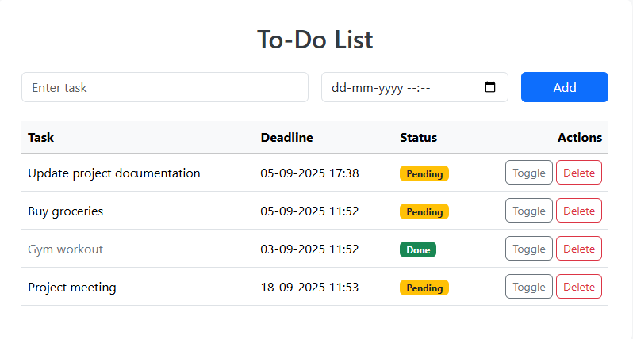

# ✅ Spring Boot To-Do Application


A full-stack, feature-rich **To-Do List Application** built with **Spring Boot MVC**. This intuitive web app allows users to manage their daily tasks efficiently with a clean, responsive interface. It demonstrates core Spring concepts like MVC architecture, JPA, and database integration.

---

## ✨ Features

-   **📝 Create Tasks:** Add new tasks with a simple form.
-   **✅ Toggle Completion:** Mark tasks as complete or pending with a single click. Completed tasks are visually struck through.
-   **🗑️ Delete Tasks:** Remove tasks you no longer need.
-   **📋 Organized List:** View all your tasks in a clean, minimalistic card layout.
-   **🔄 Live Updates:** The page automatically refreshes after any action (Create, Update, Delete) using `redirectAttributes`.
-   **💾 Persistent Storage:** All tasks are saved in a MySQL database.

---

## 🛠️ Tech Stack

-   **Backend Framework:** Spring Boot 3, Spring Web MVC, Spring Data JPA
-   **Frontend:** Thymeleaf (templating engine), HTML5, CSS3, Bootstrap 5
-   **Database:** MySQL
-   **Build Tool:** Apache Maven
-   **Java Version:** 17

---

## Project Structure

| Path | Description |
|------|-------------|
| `src/main/java/com/todo/app/TodoAppApplication.java` | Application entry point |
| `src/main/java/com/todo/app/controller/TaskController.java` | Web layer (HTTP handlers) |
| `src/main/java/com/todo/app/model/Task.java` | Data entity (JPA) |
| `src/main/java/com/todo/app/repository/TaskRepository.java` | Data access layer (JpaRepository) |
| `src/main/java/com/todo/app/service/TaskService.java` | Business logic layer |
| `src/main/resources/static/` | Static assets (CSS, JS) |
| `src/main/resources/templates/tasks.html` | Main view template |
| `src/main/resources/application.properties` | Database configuration |
| `src/test/` | Test classes |

---

## 🚀 Getting Started

### Prerequisites

-   **JDK 17**
-   **Maven 3.8+**
-   **MySQL Server** (e.g., MySQL 8.0)

### Installation & Setup

1.  **Clone the repository**
    ```bash
    git clone https://github.com/RKofficial1/to-do-app.git
    cd to-do-app
    ```

2.  **Set up the MySQL Database**
    ```sql
    CREATE DATABASE todo_db;
    -- The application will automatically create the 'task' table on startup.
    ```

3.  **Configure Database Connection**
    Edit `src/main/resources/application.properties` with your MySQL credentials:
    ```properties
    spring.datasource.url=jdbc:mysql://localhost:3306/todo_db
    spring.datasource.username=your_mysql_username
    spring.datasource.password=your_mysql_password
    spring.jpa.hibernate.ddl-auto=update
    spring.jpa.properties.hibernate.dialect=org.hibernate.dialect.MySQLDialect
    ```

4.  **Build and Run the Application**
    ```bash
    # Using Maven
    mvn spring-boot:run

    # Or run the packaged JAR file
    mvn clean package
    java -jar target/your-jar-file-name.jar
    ```

5.  **Open Your Browser**
    Navigate to [http://localhost:8080](http://localhost:8080)

---

## 📸 Application Screenshot

 <!-- Replace 'screenshot.png' with the path to your actual image -->

*The clean and functional user interface of the To-Do application.*

---

## 🔧 API Endpoints

| HTTP Method | Endpoint      | Description                |
|------------|---------------|----------------------------|
| `GET`      | `/`           | Displays the list of tasks |
| `POST`     | `/add`        | Creates a new task         |
| `GET`      | `/update`     | Toggles a task's status    |
| `GET`      | `/delete`     | Deletes a task by ID       |

---

## 🙋‍♂️ Author

**Your Name**
- GitHub: [RKofficial1](https://github.com/RKofficial1)
- LinkedIn: [Rohit](https://www.linkedin.com/in/rohit-honakhande-083538259/)


